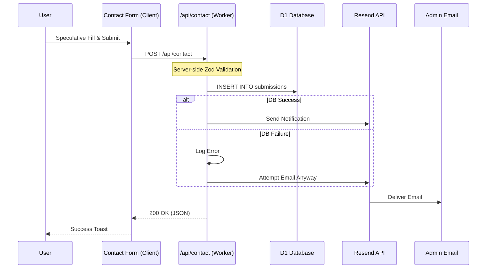

# Visual Documentation

This document provides visual diagrams to help understand the architecture and workflows of the Jacob Barkin Portfolio.

## Table of Contents

- [Project Architecture](#project-architecture)
- [Component Hierarchy](#component-hierarchy)
- [Data Flow](#data-flow)
- [Deployment Workflow](#deployment-workflow)

## Project Architecture

The architecture relies on Edge computing for performance and global distribution.

```mermaid
graph TD
    subgraph "Edge (Cloudflare)"
        A[Cloudflare Worker] --> B[Next.js App (SSR)]
        B --> C[D1 Database (SQLite)]
        B --> D[Clerk Middleware]
    end
    
    subgraph "External Services"
        D --> E[Clerk (Auth)]
        B --> F[Resend (Email)]
    end
    
    subgraph "Client"
        G[Browser] -->|Request| A
        E -->|Session Cookie| G
    end
```

### Key Components

-   **Frontend/Backend**: Next.js 15 application adapted by OpenNext to run entirely on Cloudflare Workers.
-   **Database**: Cloudflare D1 (SQLite) for storing contact submissions and embed analytics.
-   **Auth**: Clerk for securing Admin routes.
-   **Email**: Resend API for delivering contact form notifications.

## Component Hierarchy

The application follows a standard Next.js App Router structure.

```mermaid
graph TD
    subgraph "Layout.tsx"
        A[Root Layout] --> B[Clerk Provider]
        B --> C[Theme Provider]
        C --> D[Navigation]
        C --> E[Slot (Page Content)]
        C --> F[Footer]
    end

    subgraph "Pages"
        E --> G[Home Page]
        E --> H[Projects Page]
        E --> I[Contact Page]
        E --> J[Admin Dashboard (Protected)]
    end

    subgraph "Key Components"
        G --> K[Hero Section]
        H --> L[Project Cards]
        I --> M[Contact Form]
        J --> N[Data Table]
    end
```

## Data Flow

### Contact Form Submission

This flow ensures data is saved *and* emailed, with fail-safes.



## Deployment Workflow

We use GitHub Actions to deploy directly to the Cloudflare Workers network.

```mermaid
graph TD
    A[Developer] -->|Push to Main| B[GitHub Repo]
    B -->|Trigger| C[GitHub Actions]
    
    subgraph "CI/CD Pipeline"
        C --> D[Setup Bun/Node]
        D --> E[Build Worker (OpenNext)]
        E --> F[Run Lighthouse (Audit)]
        F --> G[Deploy to Cloudflare]
    end
    
    G --> H[Live Worker]
    G --> I[Static Assets (CDN)]
```
